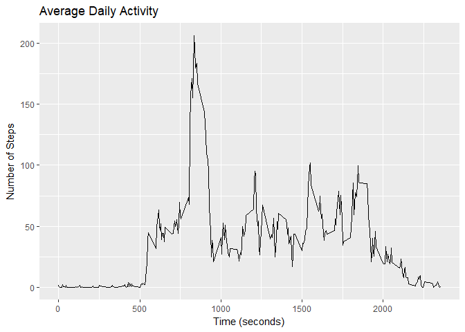
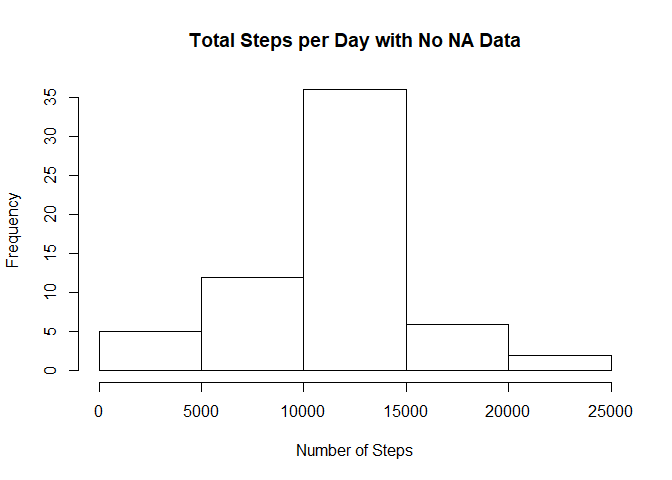
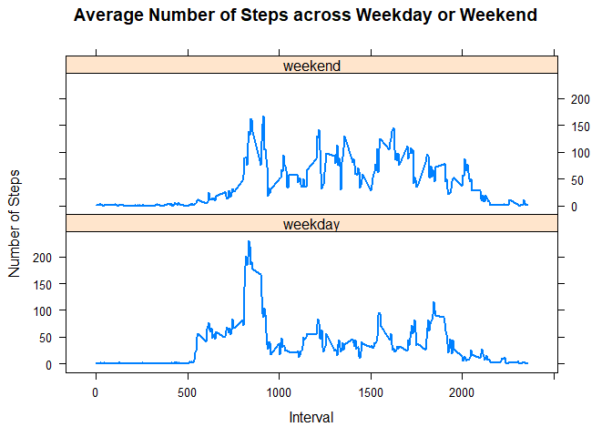

Loading the Data

```r
knitr::opts_chunk$set(echo = TRUE)
ActivityData <- read.csv("activity/activity.csv", header = TRUE)
summary(ActivityData)
```

```
##      steps                date          interval     
##  Min.   :  0.00   2012-10-01:  288   Min.   :   0.0  
##  1st Qu.:  0.00   2012-10-02:  288   1st Qu.: 588.8  
##  Median :  0.00   2012-10-03:  288   Median :1177.5  
##  Mean   : 37.38   2012-10-04:  288   Mean   :1177.5  
##  3rd Qu.: 12.00   2012-10-05:  288   3rd Qu.:1766.2  
##  Max.   :806.00   2012-10-06:  288   Max.   :2355.0  
##  NA's   :2304     (Other)   :15840
```


Histogram of the total number of steps taken each day

```r
StepsSum <- aggregate(steps ~ date, ActivityData, FUN = sum)
hist(StepsSum$steps, main = "Total Steps per Day", xlab = "Number of Steps")
```

<!-- -->


Mean and Median Number of steps taken each day

```r
MeanSteps <- mean(StepsSum$steps, na.rm = TRUE)
MedianSteps <- median(StepsSum$steps, na.rm = TRUE)
cat(" The mean number of steps taken each day is ",MeanSteps)
```

```
##  The mean number of steps taken each day is  10766.19
```

```r
cat(" The median number of steps taken each day is ",MedianSteps)
```

```
##  The median number of steps taken each day is  10765
```


Time series plot of the average number of steps taken 

```r
knitr::opts_chunk$set(error = TRUE)
library(ggplot2)
AvgStepsByInt <- aggregate(steps ~interval, ActivityData, FUN = mean)
ggplot(data = AvgStepsByInt, aes(x = interval, y = steps)) + 
  geom_line() + 
  labs(title = "Average Daily Activity") + 
  labs(x = "Time (seconds)" ) + 
  labs(y = "Number of Steps")
```

<!-- -->


The 5-minute interval that, on average, contains the maximum number of steps 

```r
IntervalWithMaxSteps <- AvgStepsByInt[which.max(AvgStepsByInt$steps),]
cat("The 5 minute inverval that contains the maximum number of steps is 835 with on average 206.2 steps")
```

```
## The 5 minute inverval that contains the maximum number of steps is 835 with on average 206.2 steps
```


Calculate and report the total number of missing values in the dataset

```r
MissingValues <- sum(is.na(ActivityData$steps))
cat("The total number of missing values in the dataset is", MissingValues)
```

```
## The total number of missing values in the dataset is 2304
```

Code describing and showing a strategy to input missing data, in which we use the mean for that 5-minute interval

```r
NewData <- ActivityData
for(i in 1:nrow(NewData)) {
  if (is.na(NewData$steps[i])== TRUE) {
    NewData$steps[i] <- AvgStepsByInt[which(NewData$interval[i] == AvgStepsByInt$interval),]$steps
  }
}
```

Histogram of the total number of steps taken each day after missing values are inputed and the mean and median total of number of steps taken 

```r
NewStepsSum <- aggregate(steps ~ date, NewData, FUN = sum)
hist(NewStepsSum$steps, main = "Total Steps per Day with No NA Data", xlab = "Number of Steps")
```

<!-- -->

```r
NewMeanSteps <- mean(NewStepsSum$steps, na.rm = TRUE)
OldMeanSteps <- MeanSteps
NewMedianSteps <- median(NewStepsSum$steps, na.rm = TRUE)
OldMedianSteps <- MedianSteps

MeanDifference <- NewMeanSteps- OldMeanSteps
cat("The difference between the mean with N/A values and the one where those values have been replaced by the mean of that 5-minute interval is",MeanDifference)
```

```
## The difference between the mean with N/A values and the one where those values have been replaced by the mean of that 5-minute interval is 0
```

```r
MedianDifference <- NewMedianSteps - OldMedianSteps
cat("The difference between the median with N/A values and the one where those values have been replaced by the mean of that 5-minute interval is", MedianDifference)
```

```
## The difference between the median with N/A values and the one where those values have been replaced by the mean of that 5-minute interval is 1.188679
```

Panel plot comparing the average number of steps taken per 5-minute interval across weekdays and weekends

```r
library(lattice)
NewData$date <- as.Date(NewData$date)
NewData$day <- weekdays(NewData$date)
NewData$weekday <- ""

NewData[NewData$day == "Saturday" | NewData$day == "Sunday",]$weekday <- "weekend"
NewData[!(NewData$day == "Saturday" | NewData$day == "Sunday"),]$weekday <- "weekday"
NewData$weekday <- factor(NewData$weekday)

AvgStepsByIntAndWeek <- aggregate(steps ~ interval + weekday, data = NewData, FUN = mean)
xyplot(steps ~interval | weekday, data = AvgStepsByIntAndWeek, 
       type = "l", 
       lwd = 2, 
       layout = c(1,2), 
       xlab = "Interval", 
       ylab = "Number of Steps", 
       main = "Average Number of Steps across Weekday or Weekend")
```

<!-- -->

